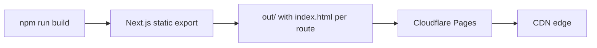

# Noctune — Technology & Tools

## Core Stack

| Layer | Technology | Version | Purpose |
|-------|-----------|---------|---------|
| **Framework** | Next.js | 16.2.7 | React framework, routing, static export |
| **Language** | TypeScript | 5.x | Type safety throughout |
| **Styling** | TailwindCSS | v4 | Utility-first CSS with `@theme inline` tokens |
| **Animation** | framer-motion | 12.x | Page transitions, entrance sequences, drag-and-drop |
| **State** | zustand | 5.x | Lightweight global state (no context boilerplate) |
| **3D** | three + @react-three/fiber + @react-three/drei | 0.185 / 9.6 / 10.7 | Hero 3D scene, interactive orbs, environments |
| **Audio** | Web Audio API | native | Procedural sound generation (no audio files) |
| **Icons** | lucide-react | latest | Icon component library |
| **Font** | Inter (via next/font) | Variable | Primary typeface per Volume 2 spec |

## Why These Choices

| Decision | Rationale |
|----------|-----------|
| **Next.js 16** | Static export for Cloudflare Pages, file-based routing, App Router |
| **Static export** | Zero server cost, global CDN, SPA-like UX after first load |
| **TailwindCSS v4** | `@theme inline` tokens map directly to Volume 2 design system; no CSS-in-JS overhead |
| **zustand** | Simpler than Redux, no providers needed, selectors prevent re-renders, works outside React (audio engine) |
| **framer-motion** | Industry standard for React animation; AnimatePresence for route transitions; Reorder for drag-and-drop |
| **Three.js/R3F** | Declarative 3D that integrates with React component model |
| **Web Audio API** | Zero bundle size for audio; fully procedural — every sound is generated in real-time |
| **no audio files** | All 56+ sounds use oscillators, noise buffers, LFOs, and scheduled intervals |
| **Inter font** | Volume 2 design spec — Geist was replaced by Inter as primary typeface |

## Package Dependencies (key)

```json
{
  "next": "16.2.7",
  "react": "^19.0.0",
  "react-dom": "^19.0.0",
  "zustand": "^5.0.0",
  "framer-motion": "^12.0.0",
  "three": "^0.185.1",
  "@react-three/fiber": "^9.6.1",
  "@react-three/drei": "^10.7.3",
  "lucide-react": "^0.500.0"
}
```

Dev dependencies: TypeScript, TailwindCSS v4, @types/three, postcss.

## Tool Interactions

```mermaid
flowchart TD
    subgraph Build
        A[Next.js Build] --> B[Static Export]
        B --> C[out/ directory]
    end

    subgraph Runtime
        D[Next.js Router] --> E[Page Components]
        E --> F[Layout: Providers]
        F --> G[Sidebar | TopBar | RightPanel | PlayerBar]
        E --> H[Zone-specific Content]

        I[Zustand Stores] --> E
        I --> G
        I --> H
        I --> J[Audio Engine]
        J --> K[Web Audio API]
        J --> L[Sleep Timer]

        M[Three.js / R3F] --> N[Hero 3D Scene]
        M --> O[Interactive Orbs]
        M --> P[Environment Selector]
    end

    subgraph Data
        Q[sounds.ts] --> I
        R[collections.ts] --> I
        S[localStorage] <--> I
    end
```

## State Management Flow

```
User Action → React Component → Zustand Store → Audio Engine → Web Audio API
                                                       ↓
                                              localStorage (persist)
```

The **7 stores** (audio, mixer, favorites, settings, ui, toast, search) each handle one concern. Stores use zustand's `persist` middleware for favorites, settings, ui, mixer — audio store is intentionally not persisted (AudioContext can't be serialized).

## Audio Engine Architecture

```
AudioEngine class (singleton)
├── AudioContext (lazy init on first user gesture)
├── masterGainNode (linearRampToValueAtTime for all volume changes)
├── Map<soundId, { gain, nodes[], cleanup }>
├── MAX_CONCURRENT_SOUNDS = 16 (soft ceiling)
├── init() → check/restore suspended AudioContext, try-catch wrapped
├── playSound(id, vol) → ensureContext() + builder graph
├── stopSound(id) → linearRampToValueAtTime fade, proper node cleanup with block-scoped try-catch
├── stopAll() → iterates activeSounds
├── fadeOutAll(sec) → linear ramp masterGain to 0, wait, stopAll, restore gain
├── suspend/resume → AudioContext.state check
└── Sleep timer → setTimeout → fadeOutAll(30) over 30 seconds
```

The engine is a singleton (`src/audio/engine.ts`). All 56+ sound profiles are defined as configuration objects with generator functions — each sound knows how to build its own oscillator/noise/interval graph. Base functions (noiseSource, lfoModulate, makeChirp, makeClick, makeCrackle, makeRumble) all use `setValueAtTime`/`linearRampToValueAtTime` for precise scheduling.

## Build & Deploy



- Build command: `npx next build`
- Output dir: `out/`
- Config: `output: "export"`, `images.unoptimized: true`, `trailingSlash: true`
- Headers file: `public/_headers` (security + 1yr immutable caching)
- Wrangler: `wrangler.toml` with `pages_build_output_dir = "out"`
